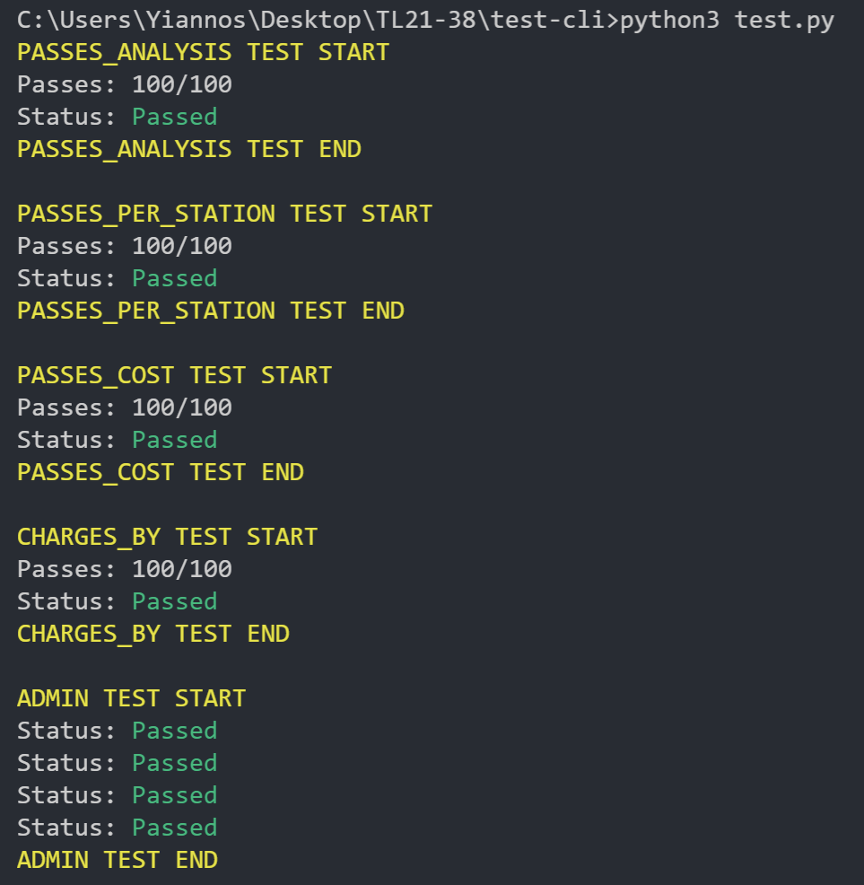

# test-cli
**Contents**:
- CLI tests

---

**Requirements**:
* Python 3
* Libraries: pandas, os, csv, colorama, pathlib, openpyxl

**How to Install libraries**:
- pip install pandas colorama pathlib openpyxl

**How to run**:
- python test.py

**Sample Output**:

&nbsp; &nbsp; &nbsp; 

**General Notes**: 
- Set the "tests" and "tests_charge" values according to the number of tests you wish to perform
- After running the cli testing script, the database needs to be restored due to api admin calls that reset some tables
- In order to run the "passesupd check", make sure that the "resetpasses check" is not commented out!

